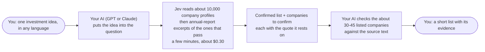

# jev-screen

**English** · [中文说明](README.zh-CN.md)

<p align="center"></p>
<p align="center"><sub>Sifted layer by layer into a short list, each pick with its evidence (illustrative numbers and names)</sub></p>

**Your GPT (or Claude) thinks up the question and checks the answers; Jev does the reading. Say one investment idea,
get a short list of listed companies worldwide, each with the text that says they do it.**

- **The pain.** There are nearly 50,000 listed companies. Having a big model like GPT read them one by one is too
  expensive and too slow, and answering from memory it may make things up.
- **The split.** Jev, a fast judging model, reads the profiles of the about 10,000 companies worth $1B or more, then
  annual-report excerpts of the ones that pass, and gives a yes/no judgement on each: a few minutes, about $0.30. Your
  GPT or Claude puts your idea into the question, then checks the few dozen that matter against the original text.
- **The result.** A short confirmed list, each company with its annual-report or profile text; the rest kept apart
  to confirm, never used to pad the list.

Stock screening is the first use of this GPT + Jev division of labour. It runs on your computer, and the list is
where your research starts, not investment advice.

## Who does what



## What we measured

On 24 test ideas (5 of them held out: not looked at while the product was tuned), the share of companies in the
confirmed list that were labelled right (strict), and how many of the companies an idea must include made that list:

| Who checks the list | Confirmed rows labelled right | Must-include companies found |
|---|---|---|
| Jev alone, before your AI's review | 90.2% of 123 rows | 39 of 61 |
| Jev + GPT review (Codex, `gpt-6-astra`), 21 of the 24 ideas | 89.7% of 145 rows (same 21 ideas: 91.3% before, 91.6% with Opus) | 33 of 49 (same 21 ideas: 31 before, 39 with Opus) |
| Jev + Claude Opus review | 91.7% of 181 rows | 50 of 61 |
| Jev + a looser AI (Claude Sonnet / Haiku) review | 80.8% / 77.3% | 49–50 of 61 |

- The right/wrong labels were written by AI readers of official filings, with a third AI deciding where two
  disagreed. **No person has checked them yet**, and 90% is not a guarantee.
- The full ranked list is much weaker: its top 10 is only about **65%** right. That is why the confirmed list is never
  padded to 10.
- With GPT as your AI the confirmed list stayed about as precise as without a review, but GPT moved fewer companies
  in and took out 9 right ones, so it found only 2 more must-include companies (Claude Opus found 8 more). Finding
  the missed companies has so far been measured with Claude Opus only: the review works best with a strong model.
- A looser AI doing the review made the list worse than no review. Every row your AI adds is marked "checked by your
  AI", and rows marked **annual report** rest on stronger evidence than rows marked **profile only**
  ([details and limits](#accuracy-and-limits)).

## Where the data comes from

| What | Where it comes from | How you may use it |
|---|---|---|
| Stock list: 49,682 listed companies, with market caps | TradingView's public pages | Personal research only: their terms restrict automated use |
| Company profiles | Yahoo, through the open-source FinanceDatabase | Personal research only |
| Annual-report text, used as evidence | Official filings: SEC (US), CNINFO (China A shares), EDINET (Japan), DART (Korea), MOPS (Taiwan), BSE (India) | For your own use |
| Who reads | Jev, paid per use | About $0.30 per idea |
| Who checks | Your own AI (GPT or Claude) | On its own quota |

- **Coverage is uneven.** Annual-report text is read automatically for China A shares and India; for the US, Korea
  and Taiwan when you allow it (SEC contact, your free OpenDART key, a yes for MOPS); for about 1,600 Japanese
  companies from the open data pack. Hong Kong, Europe, the UK, Canada, Australia and everywhere else rely on profiles unless
  the company files with the SEC; those rows are marked **profile only**
  ([which markets](#which-markets-get-an-annual-report-check)).
- **Every sentence on the result page is tagged** **Fact** (filing text, linked to its source), **Inference** (the
  AI's judgement), **Gap** (not obtained) or **Your call** (a judgement you or your AI gave on a scope question).

Every source with its tier and licence, and what leaves your computer: [Data and licences](#data-and-licences).

## Get started

Tell your AI agent (Claude Code, Codex, Cursor or another agent that can run commands on your computer):

> Install jev-screen from https://github.com/YuanTong-Wu/jev-screen and follow AGENTS.md. My idea: \<your idea\>.

You need macOS or Linux and an account that pays for Jev: TypeSafe's official API, OpenRouter or Vercel AI Gateway,
at the same price. The first top-up there is usually a few dollars; each idea then takes about $0.30 of it. The agent
asks you one round of questions, and about 15–25 minutes later the first time (about 4 minutes for later ideas) a
page with the list opens in your browser.

<details>
<summary>What you need, the one round of questions, and what happens next</summary>

**You need:**

- **An AI coding agent** that can run commands on your computer, such as Claude Code, Codex or Cursor. It usually
  needs its own paid plan, which is not part of jev-screen.
- **macOS or Linux.** Windows is not supported yet: it is untested, and the hidden key box does not exist there. WSL
  (Linux on Windows) may work but is untested too.
- **An internet connection** that reaches github.com and raw.githubusercontent.com (or cdn.jsdelivr.net),
  your Jev provider (api.typesafe.ai, openrouter.ai or ai-gateway.vercel.sh), tradingview.com and the official filing
  sites. From mainland China, several of these are often slow
  or unreachable. Your usual network setup is fine. What the tool and your agent never do is switch network or
  identity to get around a site that has blocked them.
- **An account that pays for Jev**, with credit: TypeSafe's official API, OpenRouter or Vercel AI Gateway, same
  price. The first top-up usually has a minimum (a few dollars, plus a payment fee; check the provider's payment page)
  and needs a card that pays in US dollars. That top-up is your first real outlay; each idea then takes about
  $0.25–0.30 of it. No account yet? Try TypeSafe's official API first; when its sign-ups are paused, use OpenRouter.
  On Vercel AI Gateway the Jev version cannot be pinned, and Jev may not be in the free tier.
- **On a Mac,** the first `git` command may open a box that offers to install the command line developer tools.
  Click Install; it takes a few minutes. If your computer has neither `uv` nor Python 3.10 or newer, the agent asks
  you to run one command that installs `uv`, which brings its own Python. jev-screen itself needs no admin rights.

The agent installs it and then asks you **one round of questions**, all in one message:

1. **A heads-up on two data sources, and your OK.** The stock list and company profiles come from TradingView and
   Yahoo (via FinanceDatabase). That is a gray area: their terms don't actually allow automated bulk use, and you may
   occasionally get rate-limited or briefly blocked. So the data stays on your computer for your own research; don't
   share it. Annual reports downloaded from official sites (SEC, CNINFO, BSE, ...) are the same: for your own use.
   Company profiles and report excerpts are sent to Jev to be read
   ([what leaves your computer](#what-leaves-your-computer)). If you say no, it stops, because there is no screen
   without a stock list.
2. **A spending cap, $1 by default.** The agent shows you the English sentence the AI will be asked about and the
   expected cost (about $0.30). The cap is hard: the run stops before it would spend more. Anything above $1 needs
   your explicit yes to that number.
3. **Which Jev account you have**, when no key is set yet: TypeSafe's official API
   ([keys](https://console.typesafe.ai/keys)), OpenRouter ([keys](https://openrouter.ai/settings/keys)) or Vercel AI
   Gateway (API Keys page in the Vercel dashboard). The agent gives you the sign-up link and the key step for each. A
   hidden input box then opens on your screen for the key, so it never passes through the chat; never paste it there.
   Giving the key a spending limit of a few dollars is a good idea where the provider allows it.

After that:

1. Free downloads, about 1 minute. They start while you are still creating the key.
2. A test that the key can pay, about $0.0001.
3. The AI reads, about 2 minutes.
4. Annual reports are fetched, usually about 1 minute and at most 2–3 minutes (free), then the companies whose
   evidence changed are checked again within your cap (at most $0.05).
5. The page opens.

The first time takes about 15–25 minutes, including the sign-up. The agent tells you the progress about
once a minute.

Other questions come only if something changes: the estimate goes over your cap, the budget runs out, the English
sentence changes its meaning, or your Jev provider reports no credit. Optional questions may come with the result, only
when they help your idea (just say no if you like; the result stays):

- **Fill missing company profiles.** Many Chinese companies have no profile in the free data. For a Chinese idea they
  are filled by default, free, in the background while you set up the key, so the AI reads them in the first pass
  (say no if you do not want it). Only if that fill failed or timed out (not after TradingView refused: then nothing is
  sent for 24 hours) are you asked afterwards; then the AI reads only the new ones and re-ranks (a few cents, within your cap), and your AI
  checks the companies that come in before the list is shown again.

- **An SEC contact for US annual reports** (only when a US company is in the top 10, or a large US company's profile is too thin to judge without its report; the question names them). The SEC asks everyone who downloads filings to include a name and email
  with each request. There is no account; they go only to sec.gov, and a separate address is fine. If you decline,
  US companies are judged from their profiles only, which is less accurate.
- **Taiwan annual reports from MOPS** (only when a Taiwan company is in the top 10). This is off by default, because that site's robots.txt says it does not want
  automated downloads.

[AGENTS.md](AGENTS.md) is written for your AI agent (it is English and technical): let the agent follow it. Every
command and flag is in [docs/REFERENCE.md](docs/REFERENCE.md).

</details>

## An example

You tell your AI agent:

> Find companies that sell identity and access control for enterprise AI agents.

About 15 minutes later on a first run (about 4 minutes for later ideas), it answers in chat and a page opens in your
browser. The companies below are placeholders, because real rows quote filings and profiles that are for personal use
only. The count, cost and time are typical first-run values.

```text
Done: 3 confirmed; 21 more to confirm (not in the confirmed list). Cost $0.31, took 12 min. Results page:
opened in your browser. For your personal research only; please do not share.
The confirmed list only takes companies judged central on the first read whose text the AI found states this business
plainly; it is not padded to 10. The 21 to confirm (e.g. Company D, Company E, Company F) look related to the AI, but
the first read did not judge it their central business, their texts do not state it plainly, there is only a profile,
or they were moved down; they are in the page's "To confirm" section.

1. Company A (NASDAQ:AAAA, US) - identity security for human and machine accounts; Stated, annual report
2. Company B (TSE:0000, JP) - privileged-access management software; Stated, annual report
3. Company C (SZSE:000000, CN) - zero-trust access gateway for enterprises; Clearly fits, annual report, checked by
   your AI
```

The numbered list holds only the companies the first read judged central and whose text the AI found states the
business plainly (an inference, with the passage under each); how many that is depends on the idea, and a list of
three, or none, is a normal result. Everything else the AI found related (a related business on the first read, a
profile only, a text that does not say it plainly) is kept apart under **To confirm**, never used to fill the list.
Your own AI reads those first, and one whose text it finds plainly states the business, citing the sentences, moves
into the list, marked "checked by your AI".

<details>
<summary>What the result page shows</summary>

On the page, every row carries its evidence, and four kinds of statement are kept apart:

| Label | What it is |
|---|---|
| **Fact** | The passage from the company's latest annual report (with the filing date and a link to the filing), or its profile when no report is available |
| **Inference** | The AI's verdict: **Clearly fits** (`explicit`: the text says it plainly), **Related** (`partial`: related, or only part of the business) or **Borderline** (listed, but shaky; see below) |
| **Gap** | What is missing: no annual report, a stale filing, or no description at all |
| **Your call** | A judgement you, or your AI on your behalf, gave on a calibration question (below) |

**Borderline** (边缘 on a Chinese page) is the third verdict. The company is listed, but its read is shaky: the AI's
repeated reads disagree (their average lands between 0.40 and 0.60, so another read could flip it), the quoted
excerpt does not mention your idea at all, or your answer to a scope question moved it down. Check a Borderline row
before you count it. It is not the same as the **edge** label of the evaluation below, which judges the business
itself.

It is one page per idea, and it opens in your browser at the first step: on top a checklist of what is ready (green
checks, or a red cross with one plain sentence and the fix; it folds into one green line once everything passes),
then the live progress (downloads, the AI's reads, the money spent) while the work runs, then the whole confirmed
list (every confirmed company, not only 10; the chat names the first 10 and says how many more the page has) and,
apart from it, the companies to confirm. It refreshes itself while the work runs. Below them you find the companies
that passed the first read but could not be confirmed (**unverified**) and the gaps. The page is a local HTML file, all in your language (Chinese or
English), and opening it makes no network requests. Profiles and excerpts in other languages are translated by your own AI agent, marked
"AI translation", with the original one tap away.

</details>

## How it works, step by step

1. It builds a local list of every primary listed stock worldwide (one main listing per company, nearly 50,000) with
   its market cap. Blank-check shells (SPACs) are dropped, and A shares under an exchange risk warning (ST / \*ST) are
   flagged. By default only companies worth $1B or more are read: about 10,000.
2. Your AI puts the idea into the question Jev is asked. When the idea is not in English, it writes one English
   sentence, which you see before anything is spent.
3. Jev reads each company's profile once and asks: does its current business match the idea?
4. For the companies that pass, jev-screen fetches the newest official annual report it can get (free, from official
   sites; [which markets](#which-markets-get-an-annual-report-check)), and Jev checks short excerpts from it.
5. It ranks the companies. A label confirmed by an annual report counts twice as much as the same label read from a
   profile, and the model's confidence adds to that. Only the confirmed ones make the numbered list; the rest go to
   the separate "To confirm" section.
6. Your own AI reads the quoted sentences of every listed company (typically 30–45, the ones to confirm first) and
   judges each from those sentences only, citing them. One whose text plainly states the business moves into the
   list, marked "checked by your AI"; one whose text contradicts the idea leaves it. This runs on your AI's own quota
   and takes 5–10 minutes.
7. You get the page, plus `jevscreen why` to answer "why is X (not) in the list?".

## About Jev, the model

<details>
<summary>Where you buy it, why this model, who gets your money, privacy</summary>

The AI is **Jev** 1.13, made by [TypeSafe](https://docs.typesafe.ai). The project is named after it.

- **Where you buy it:** Jev via TypeSafe's official API, OpenRouter or Vercel AI Gateway, same price: US$0.042 per
  million input tokens, output free. Any one account is enough, and jev-screen uses the key you set last.

  | Provider | Model id jev-screen sends | Version | Key |
  |---|---|---|---|
  | [TypeSafe official API](https://console.typesafe.ai/keys) (sign-ups are sometimes paused) | `jev-1.13.0` | pinned | `jevscreen keys set typesafe` |
  | [OpenRouter](https://openrouter.ai/settings/keys) | `typesafe/jev-1.13` | pinned to 1.13 | `jevscreen keys set openrouter` |
  | [Vercel AI Gateway](https://vercel.com/docs/ai-gateway/sdks-and-apis/typesafe) | `typesafe-ai/jev` | **version cannot be pinned**: Vercel offers only this unversioned id | `jevscreen keys set vercel` |

  With several keys set, the one set last is used (`jevscreen keys use typesafe|openrouter|vercel` switches without a
  new key; `jevscreen keys clear <provider>` removes one). Answers are cached per provider, so switching provider
  reads (and pays) again once; the switch says how much was already paid through the old one.
- **Why this model:** it answers multiple-choice questions with a probability for each option, and it is cheap. A
  first read of about 20,000 company profiles cost about $0.71. The probabilities let jev-screen rank by confidence
  and re-read the companies near the borderline.
- **Who gets your money:** you pay the provider you chose directly, with your own key. The code sends no referral,
  affiliate or app id with its requests.
- **Privacy:** if your idea is sensitive, check the chosen provider's data settings first (for example OpenRouter's
  [privacy settings](https://openrouter.ai/settings/privacy), or Vercel AI Gateway's
  [data handling](https://vercel.com/docs/ai-gateway/faq)).

</details>

## What it costs

jev-screen itself is free (MIT). It has no server and no account. Downloads and annual reports are free. The Jev
model is paid from **your** credit at TypeSafe, OpenRouter or Vercel AI Gateway (same price at all three).

| What | Money | Basis | Time |
|---|---|---|---|
| First idea with `quickstart`: companies from $1B market cap, about 10,000 of them | about $0.30 | estimate (the program expects $0.20–0.40) | 15–25 min the first time, including downloads and sign-up |
| Every further idea | about $0.25 | estimate | about 4 min, plus up to 2–3 min fetching annual reports |
| The same idea again through `quickstart`, nothing changed | $0 | measured (answers are cached) | seconds; a cached `screen` rerun takes about 1 min |
| Answering the cards and re-ranking | about $0.01–0.03 | measured $0.002–0.027 per idea; capped at $0.05 by default | about 1 min |
| A wider screen: about 20,000 companies from $200M (`screen --min-mcap 2e8`) | about $0.71 | measured, on a store with more profiles than a new install | about 4 min of AI reads |
| Test that the key can pay | about $0.0001 | measured | seconds |

Outside jev-screen, you also pay your AI agent's plan and the first top-up at your Jev provider (see above).

Every paid request is logged locally with its cost. An answer already paid for is not paid for again. The one
exception is a rare resend after an interrupted request, which costs under 1 cent and stays within your cap. A dry
run (`--dry-run`) prints the estimate without spending anything. Running `jevscreen screen` by hand without flags
uses the program's own defaults: a $3 cap and companies from $200M (about $0.71). Agents always pass `--budget` and
`--min-mcap`.

## Which markets get an annual-report check

| Check | Markets |
|---|---|
| **Annual report, automatic** | China A shares (CNINFO); India (BSE, up to 40 companies per run) |
| **Annual report, if you allow it** | US and companies filing 10-K / 20-F with the SEC (needs your SEC contact); Korea (your own free OpenDART key: `keys set opendart`; up to 20 per run); Taiwan (a separate yes for MOPS; up to 8 per run, slowly) |
| **Japan** | The open data pack (about 1,600 companies in the packs published so far), or `sync-edinet` with your own free EDINET key |
| **Profile only** | Hong Kong, Europe, UK, Canada, Australia, Southeast Asia and everywhere else, unless the company also files with the SEC |

China, India and Taiwan reports are PDFs. The standard install includes a PDF reader for them (`pypdf`).

## Data and licences

The code is MIT. **The data is not**: each source keeps its own terms, and the MIT licence grants nothing over that
data. The full per-source table is in [DATA_LICENSES.md](DATA_LICENSES.md).

<details>
<summary>Every source, its tier and when it is used</summary>

| Data | Source | Tier | When |
|---|---|---|---|
| Stock list, market caps | TradingView scanner | gray-private | after your consent; about 1 minute |
| Company profiles | FinanceDatabase bulk file `equities.bz2` (Yahoo text, 15 MB, from GitHub raw or jsDelivr) | gray-private | after your consent; about 1 minute |
| More profiles, optional | TradingView symbol pages (`crawl-descriptions`) | gray-private | only when you agree; long |
| Annual reports, on demand | SEC EDGAR (US, needs your SEC contact), CNINFO (China A shares), BSE (India), OpenDART (Korea, your key), MOPS (Taiwan, asked separately) | official-private | only for the companies a screen shortlists, capped per run |
| Annual reports, bulk, optional | the same sources plus EDINET (Japan, your free key) through the `sync-*` commands | official-private | only when you run them |
| Open data pack | SEC ticker list; EDINET code list and 事業の内容 (Japan) | official-open / PDL 1.0 | automatic, no key |

The tiers mean:

- **gray-private:** the data is public, but the site's terms restrict reuse or automated use (TradingView forbids
  algorithmic use of its data). It is personal use only, it needs your recorded consent, and it is never
  redistributed, by this project or by you. "Gray" names that conflict with the terms. It is not a legal opinion.
- **official-private:** official filings without a redistribution grant. They are personal use only: the full text
  stays on your machine, and only short excerpts are sent to the AI to be read.

</details>

### What leaves your computer

| What | Goes to |
|---|---|
| Your idea as you wrote it, its English sentence, the rule sentences from your card answers, company profile text and short annual-report excerpts | Your Jev provider (TypeSafe, OpenRouter or Vercel AI Gateway) and whoever serves Jev behind it |
| Download requests. The filing sites see which companies are requested. | TradingView; GitHub or jsDelivr; the official filing sites (SEC, CNINFO, BSE, DART, MOPS); GitHub for the open data pack |
| Your SEC name and email | sec.gov only, with those downloads |

Nothing goes to this project, and there is no telemetry. Keep the lists, reports and pages you make to yourself,
because they are built from personal-use data. Nothing here is legal advice. When in doubt, keep the data on your
own machine.

## Accuracy and limits

**What the numbered list is.** The page has two lists. The numbered one, the **confirmed list**, holds only the
companies whose text, as the AI read it, plainly states the business: the first read judged the business central
and the annual report or profile says it outright, or your own AI read the quoted sentences and confirmed it. It is
never padded to 10. Everything else the AI found related goes under **To confirm**, below it, and is never counted
as a result. A confirmed list of 3, or none, is a normal result.

<details>
<summary>Measured numbers, how they were measured, and known weaknesses</summary>

**Measured numbers** (24 ideas, 5 of them held out: not looked at while the product was tuned; 2026-09-29):

| | Before your AI's review | After your AI's review |
|---|---|---|
| Confirmed rows labelled right (strict) | **90.2%** of 123 rows (95% range 83.7–94.3%) | **91.7%** of 181 rows (95% range 86.8–94.9%) |
| Right or borderline (lenient) | 97.6% | 99.5% |
| Held-out ideas only (strict) | 95.5% of 22 rows | 97.2% of 36 rows |
| Confirmed rows per idea (median) | 3 (one idea had none) | 5.5 (every idea had at least 3) |
| Companies an idea must include that made the confirmed list | 39 of 61 (64%) | 50 of 61 (82%) |

- **Strict** counts only companies labelled right; **lenient** also counts borderline ones (related, but the filing
  shows only a component, a plan, or does not name the idea's target). The 95% range is a Wilson interval, which
  treats each row as independent, so it is optimistic when one idea contributes many rows.
- **The review was done by a strong AI** (Claude Opus). The same review done by looser AIs made the list worse
  than no review at all: **80.8%** strict with Claude Sonnet and **77.3%** with Claude Haiku. They found as many
  of the must-include companies (49–50 of 61), but also confirmed component suppliers and planned businesses, and
  Haiku removed 12 companies that were right. If your AI is a small or fast model, trust the rows it did not add:
  every row it added is marked "checked by your AI".
- **GPT as the reviewer** (via Codex, model `gpt-6-astra`; 21 of the 24 ideas, because the Codex quota ran out
  before the last 3): **89.7%** strict of 145 rows (95% range 83.6–93.6%), 98.6% lenient, a median of 4 confirmed
  rows per idea. On the same 21 ideas the list scored 91.3% before the review (median 3) and 91.6% after Claude
  Opus's review (median 5). So GPT kept the list about as precise as no review, without the loose confirmations of
  Sonnet and Haiku, but it answered "partial" or "unsure" more often and removed 9 right companies, so only 33 of
  49 must-include companies made the list (31 before, 39 with Opus). One run, one model: the gain in companies
  found is so far shown with Claude Opus only.
- **The full ranked list is much weaker.** Its top 10 is only about **65%** right (strict). That is why the numbered
  list is not padded to 10, and why the to-confirm companies are there to check, not to count.

**How it was measured.** For each of the 24 ideas, every company in the confirmed list was labelled right,
borderline or wrong from its official filings (annual reports, exchange filings or the company's investor-relations
material), never from the Yahoo or TradingView profiles. The labels were written by AI readers of those filings:
most by one careful AI reader, the later ones by two AI labellers working independently, with a third AI deciding
where they disagreed. **No person has reviewed them yet**, and the labelled ideas are not published in this repository yet, so these numbers cannot be
reproduced from it today. The method and the scoring tool are in [docs/EVAL.md](docs/EVAL.md) (`jevscreen eval`).

**Known weaknesses:**

- **Thin lists.** Before the review the median idea confirmed 3 companies, and some confirmed 0–2. A short list
  means the text did not say it plainly, not that nothing else fits: read the to-confirm section.
- **Borderline promotions.** Most mistakes are borderline companies, not wrong ones: a maker of a part for the
  product, or a company that only plans the business. With a strong reviewer 6 of 63 promotions were borderline;
  with looser ones 27 of 86–92.
- **Gaps by market.** Where no annual report can be read, a company is judged on its profile only, and a thin
  profile can keep a real company out (the page names these, for example a large US company when you did not give
  the SEC contact). US reports need your SEC contact, Korea an OpenDART key, Taiwan your yes to MOPS; Hong Kong,
  Europe, Southeast Asia and most other markets have profiles only ([which markets](#which-markets-get-an-annual-report-check)).
  Companies with no profile at all are listed as a gap, not screened.
- **Supply-chain ideas are harder.** The AI can confuse roles: it may take buyers, makers of generic parts, or mere
  shareholders for suppliers.
- **Reads vary.** The same text can get a slightly different answer on another read, so companies near the boundary
  are read 3 times and averaged, and a rerun can still swap a few rows near the cut.
- **Cards fix what you answer, not everything.** They cannot add right rows that the data does not show.
- **Small sample.** 24 ideas and one review run per model; the numbers can move as more ideas are labelled.
- It does not value companies, look at prices or tell you what to buy. The rank reflects how strong the evidence is,
  not investment merit.

</details>

## Next time, stopping, and removing it

- **A new idea:** open your AI agent in the jev-screen folder and say "Screen with jev-screen: \<new idea\>". It costs
  about $0.25 and takes about 4 minutes, with no new downloads.
- **Old results:** `jevscreen page latest --open` opens the newest page. Each run's page is in its own folder under
  `data/screens/`.
- **Stopping midway:** ask your agent to stop, or press Ctrl-C when you run `screen` in your own terminal. Answers
  already paid for are kept, a rerun continues from there, and your cap still holds.
- **Disk space:** the quickstart path usually needs well under 1 GB. A store with every bulk sync done is about 2 GB.
- **Removing it:** delete the jev-screen folder (your data, keys and consent records are all inside its `data/`), and
  delete the key at your Jev provider (TypeSafe, OpenRouter or Vercel).

## Commands

Your agent runs these for you. `quickstart`, `doctor`, `why`, `answer`, `fetch-docs`, `page`, `cards`, `coverage` and
`sieve` take `--json`. The other commands print their own summary and reject the flag. The main flags are listed in
[docs/REFERENCE.md](docs/REFERENCE.md), and `jevscreen <command> --help` lists them all. JSON formats are in
[docs/AGENT_API.md](docs/AGENT_API.md).

<details>
<summary>All commands</summary>

| Command | What it does | Cost |
|---|---|---|
| `jevscreen quickstart "<idea>" --json` | The whole path from an idea to the page, with one round of questions | within the cap you approve |
| `jevscreen doctor --json` | What is set up, what is missing, and the next command | free |
| `jevscreen keys set typesafe\|openrouter\|vercel --dialog` / `keys check` | Store a key from a hidden box on your screen; the key is never shown. In your own terminal: `keys set NAME` | free |
| `jevscreen consent set gray-sources yes\|no` | Record your answer on the restricted sources | free |
| `jevscreen screen "<idea>" --min-mcap 1e9 --budget 1 [--dry-run]` | A screen with every setting (countries, market cap, reads) | paid, hard budget |
| `jevscreen page latest --open` | Rebuild and open the result page | free |
| `jevscreen why <ticker> --run <run_id>` | Why a company is or is not in the list, and what would change that | free |
| `jevscreen answer "1a 2h 3c" --deck <deck>` | Apply your card answers and re-rank | about $0.01–0.03 |
| `jevscreen fetch-docs latest` | Fetch missing annual reports for a run's shortlist and update it | free fetch, at most $0.05 |
| `jevscreen sieve add should_pass <ticker> --run <run_id>` | Add a company you expect; the next run checks it and reports on it | free |
| `jevscreen pack pull` | Import the open data pack | free |
| `jevscreen status` / `coverage` | Row counts; data gaps by region, source and licence | free |
| `jevscreen refresh-universe`, `crawl-descriptions`, `sync-sec` / `-cninfo` / `-edinet` / `-dart` / `-mops` / `-bse` | Manual data syncs | free; some take hours |
| `jevscreen import-fd` | Import profiles from a local FinanceDatabase DuckDB file. This is not needed with quickstart, which downloads the profiles itself | free |

</details>

## Calibration cards

<details>
<summary>What the cards are and how your AI uses them</summary>

An AI reading text makes the same few kinds of mistake over and over: it takes a buyer for a supplier, matches a
word that means something else, or reads a one-line plan as a business. Only you know where your idea's borders
are. So after each run jev-screen prepares up to 8 **cards** (`jevscreen cards`). Each card is a company near the
border, with a short quote from its evidence (the passage that best matches your idea's keywords).

Cards are not a chore for you: they are a tool for your AI agent. When you ask it to sharpen the list, it reads the
cards, answers **keep** or **drop** with a reason (for example "a buyer, not a supplier") and applies them with one
line such as `jevscreen answer "1a 2h 3c" --deck deck-...`. It costs about $0.01–0.03. Your answers are remembered for this idea, and the list is re-ranked without reading the
profiles again. The next run of the same idea uses them too. Cards cannot invent right rows that the data does not
show.

The mechanics are in [docs/DATA_RULES.md](docs/DATA_RULES.md) under "Calibration": the reason letters a–k, how
answers become rules, and keyword learning. The accepted answer forms are in the `answer` row of
[docs/REFERENCE.md](docs/REFERENCE.md#commands). What your AI may write into an idea's settings file is in
[docs/SIEVE.md](docs/SIEVE.md).

</details>

## Open data pack

<details>
<summary>What is in it and how it is used</summary>

The open data pack is free. It is published as GitHub Releases of this repository (`pack-YYYY-MM-DD`) when available;
there is no fixed schedule yet. It holds only data whose licence allows redistribution:

- the SEC ticker list;
- for Japan, the EDINET code list plus the 事業の内容 (business description) section of each company's latest
  有価証券報告書 (annual securities report), under the Public Data License 1.0 with attribution. The packs published so far
  cover about 1,600 companies.

`quickstart` pulls the newest published pack automatically, so the Japanese companies in it can be checked against
their own filings without an EDINET key. When no pack can be fetched, Japan uses profiles.

`jevscreen pack pull` imports the pack by hand, and every file is checked against its sha256. The pack contains
nothing from TradingView or Yahoo and no other annual-report text.

One caveat is still open: it is not confirmed that the EDINET licence covers issuer-written 事業の内容 text. The pack
says so. Details are in [docs/OPEN_PACK.md](docs/OPEN_PACK.md).

</details>

## FAQ

<details>
<summary>Investment advice, privacy, sharing, missing companies, other data sources</summary>

**Is this investment advice?** No. It finds companies whose annual reports or profiles match your idea, and it shows
the evidence. It does not value them, time them or recommend them. Check the filings yourself before any decision.

**What leaves my computer, and who can see it?** See [the table above](#what-leaves-your-computer). In short:

- Your idea, its English sentence, your rule sentences, profile text and short excerpts go to your Jev provider
  (TypeSafe, OpenRouter or Vercel AI Gateway) and whoever serves Jev behind it.
- Download requests go to the data sites.
- Your SEC contact goes only to sec.gov.

Keys are stored in `data/`, readable only by your user account, and are never printed.

**Can I share the list or the page?** Not the ones built from the default sources, because they come from
personal-use data. You can share the code, your idea, and anything built only from the open data pack. The same rule
is in [DATA_LICENSES.md](DATA_LICENSES.md) and [docs/DATA_RULES.md](docs/DATA_RULES.md).

**Why is company X missing (or there)?** Ask your agent. It runs `jevscreen why X --run <run_id>` (free) and tells you
in one sentence where X stopped (market cap, no description, the first read, the annual-report check or the ranking)
and what would change that. If you know X belongs, add it as a check (`sieve add should_pass`) or answer its card.

**Can I use it without TradingView and Yahoo data?** No. There is no free, licence-clean list of the world's stocks
with business descriptions that it could use instead, and the open data pack covers only US tickers and Japan. If
you say no to those sources, jev-screen stops and does not ask again.

</details>

## Licence

- **Code and documentation:** MIT ([LICENSE](LICENSE)).
- **Data:** each source's own terms ([DATA_LICENSES.md](DATA_LICENSES.md)).
- **Test PDFs:** two of them embed an Apache-2.0 font subset ([LICENSES/Apache-2.0.txt](LICENSES/Apache-2.0.txt)).
- **Security:** report leaks and vulnerabilities privately ([SECURITY.md](SECURITY.md)).
- **Contributing:** before opening a pull request or publishing a fork, run `python3 tools/release_check.py`. It must
  print `release_check: clean`.
